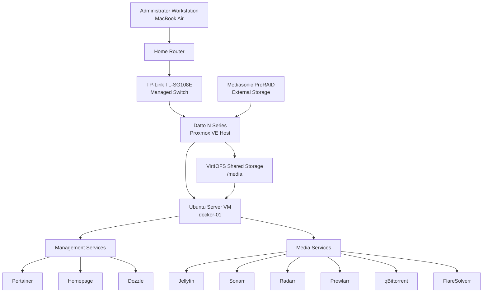

# Project Atlas Architecture Overview

## Purpose

Project Atlas is a documented homelab platform designed to develop practical skills in virtualization, Linux administration, containerization, networking, storage, monitoring, automation, and troubleshooting.

The environment currently consists of a Proxmox virtualization host, an Ubuntu Server Docker virtual machine, shared external storage, infrastructure-management services, and a self-hosted media platform.

---

## Current Architecture



---

## Virtualization Layer

### Proxmox Host

| Component | Value |
|---|---|
| Hostname | `datto` |
| Platform | Proxmox VE |
| Role | Primary virtualization host |
| Management Address | `192.168.1.66` |
| Primary VM | Ubuntu Docker Server |

### Ubuntu Docker VM

| Component | Value |
|---|---|
| VM ID | `100` |
| Hostname | `ubuntu-docker` |
| Role | Docker application host |
| LAN Address | `192.168.1.243` |
| Container Runtime | Docker Engine |
| Orchestration | Docker Compose |

---

## Storage Architecture

The Mediasonic ProRAID enclosure is attached to the Proxmox host and mounted at:

```text
/mnt/pve/media
```

The `docker-media` directory is passed into the Ubuntu VM through VirtIOFS and appears inside the VM at:

```text
/media
```

### Standardized Data Layout

```text
/media
├── data
│   ├── media
│   │   ├── movies
│   │   └── tv
│   └── torrents
│       ├── incomplete
│       ├── movies
│       └── tv
└── docker
    ├── prowlarr
    ├── qbittorrent
    ├── radarr
    └── sonarr
```

A common `/data` path is exposed to the media containers to maintain consistent paths between qBittorrent, Sonarr, Radarr, and Jellyfin.

---

## Service Architecture

### Infrastructure Management

| Service | Purpose | Port |
|---|---|---:|
| Homepage | Central service dashboard | 3000 |
| Portainer | Docker container management | 9443 |
| Dozzle | Live Docker log viewing | 8081 |

### Media Platform

| Service | Purpose | Port |
|---|---|---:|
| Jellyfin | Media streaming server | 8096 |
| Prowlarr | Centralized indexer management | 9696 |
| Sonarr | Television library automation | 8989 |
| Radarr | Movie library automation | 7878 |
| qBittorrent | Download client | 8082 |
| FlareSolverr | Supported Cloudflare challenge proxy | 8191 |

---

## Media Workflow

```mermaid
flowchart LR
    PROWLARR[Prowlarr] --> SONARR[Sonarr]
    PROWLARR --> RADARR[Radarr]

    SONARR --> QBIT[qBittorrent]
    RADARR --> QBIT

    QBIT --> TORRENTS[/data/torrents]

    TORRENTS --> SONARR
    TORRENTS --> RADARR

    SONARR --> TV[/data/media/tv]
    RADARR --> MOVIES[/data/media/movies]

    TV --> JELLYFIN[Jellyfin]
    MOVIES --> JELLYFIN
```

---

## Remote Administration

Project Atlas is administered through:

- Proxmox web interface
- SSH
- VS Code Remote SSH
- Tailscale
- Portainer
- Homepage

Local IP addresses are currently used when Tailscale MagicDNS is unavailable.

---

## Monitoring Roadmap

Release `v0.3.0` will add:

- Prometheus
- Grafana
- Node Exporter
- cAdvisor
- Host and container health dashboards
- Historical CPU, memory, disk, and network metrics
- Monitoring documentation and verification procedures