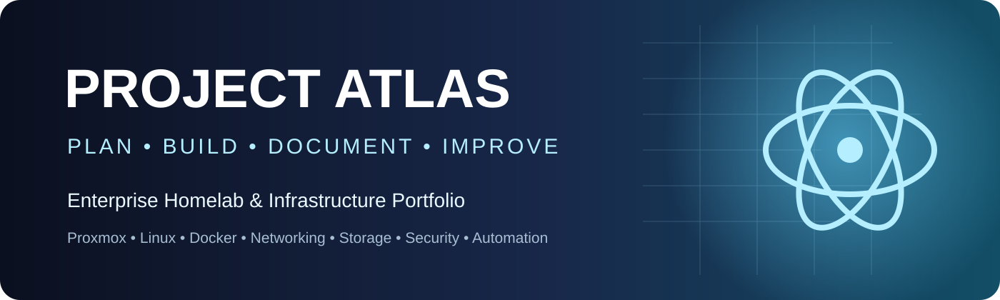
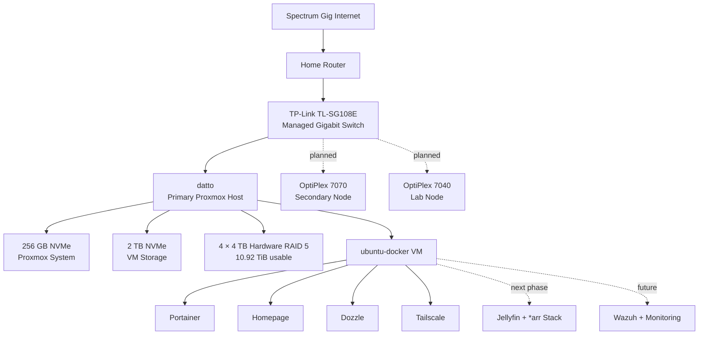

<p align="center">
  
</p>

<p align="center">
  <strong>An enterprise-style homelab built, tested, troubleshot, and documented from the ground up.</strong>
</p>

<p align="center">
  <a href="ROADMAP.md"></a>
  <a href="PROJECT-JOURNAL.md"></a>
  <a href="docs/06-Storage/README.md"></a>
  <a href="LICENSE"></a>
</p>

---

## Overview

**Project Atlas** is Brandon Bilger's hands-on infrastructure portfolio. It demonstrates practical experience with virtualization, Linux administration, networking, storage, containers, remote access, troubleshooting, monitoring, security, automation, and professional technical documentation.

The repository is designed for two audiences:

- **Hiring managers:** a fast, visual overview of the systems built and skills demonstrated.
- **Builders and learners:** reproducible documentation with implementation steps, verification, screenshots, and lessons learned.

> The goal is not merely to show that the lab works. The goal is to demonstrate how it was planned, built, verified, repaired, and improved.

---

## Current Build Status

| Area | Status | Evidence |
|---|---:|---|
| Planning and repository structure | ✅ Complete | [Planning](docs/01-Planning/README.md) |
| Primary Proxmox host | ✅ Operational | [Proxmox](docs/04-Proxmox/README.md) |
| Ubuntu Docker VM | ✅ Operational | [Virtual Machines](docs/04-Proxmox/Virtual-Machines.md) |
| Docker management platform | ✅ Operational | [Docker](docs/05-Docker/README.md) |
| Remote administration | ✅ Operational | Tailscale, SSH, VS Code Remote SSH |
| 12 TB RAID 5 storage | ✅ Operational | [Storage case study](docs/06-Storage/README.md) |
| Managed networking and VLANs | 🟡 In progress | [Network](docs/03-Network/README.md) |
| RackMate T2 installation | 🟡 In progress | [Hardware](docs/02-Hardware/README.md) |
| Media automation stack | ⚪ Planned | [Media Stack](docs/07-Media-Stack/README.md) |
| Monitoring and Wazuh | ⚪ Planned | [Monitoring](docs/08-Monitoring/README.md) |
| Three-node Proxmox environment | ⚪ Planned | [Roadmap](ROADMAP.md) |

---

## Architecture



---

## Featured Milestone: RAID 5 Recovery and Integration

The Mediasonic ProRAID enclosure initially:

- spun up all drives,
- beeped and flashed red,
- powered the drives down,
- exposed a 0-byte disk over USB,
- and showed no usable eSATA link.

The issue was traced to an incomplete hardware RAID initialization process. A hidden confirmation button was required to commit the selected RAID mode. Once confirmed, Proxmox detected a single **10.92 TiB** device. The disk was initialized with GPT and added as ext4 directory storage at:

```text
/mnt/pve/media
```

This milestone demonstrates hardware diagnosis, Linux storage validation, risk recognition, recovery, and documentation.

[Read the complete storage case study →](docs/06-Storage/README.md)

---

## Hardware Platform

| Component | Specification | Role |
|---|---|---|
| Primary host | Datto / Dell OptiPlex 7000 Micro | Proxmox VE |
| CPU | Intel Core i5-12500T | Virtualization |
| Memory | 16 GB DDR5 | Current host memory |
| System storage | 256 GB KIOXIA NVMe | Proxmox OS |
| VM storage | 2 TB SK hynix PC801 NVMe | VM and container disks |
| Bulk storage | Mediasonic HFR2-SU3S2 | Hardware RAID enclosure |
| RAID disks | 4 × 4 TB HDD | 10.92 TiB RAID 5 |
| Switch | TP-Link TL-SG108E | Managed gigabit networking |
| Administration | MacBook Air M5, 16 GB | Primary management workstation |
| Rack | DeskPi RackMate T2 | Compact infrastructure rack |
| Fabrication | Bambu Lab P1S | Custom rack parts and accessories |

[View the full hardware inventory →](docs/02-Hardware/Hardware-Inventory.md)

---

## Deployed Technologies

`Proxmox VE` · `Ubuntu Server` · `Docker CE` · `Portainer` · `Homepage` · `Dozzle` · `Tailscale` · `SSH` · `VS Code Remote SSH` · `LVM-Thin` · `ext4` · `Hardware RAID 5` · `GitHub`

---

## Documentation

| Phase | Focus | Status |
|---:|---|---:|
| 01 | [Planning and standards](docs/01-Planning/README.md) | ✅ |
| 02 | [Hardware and rack](docs/02-Hardware/README.md) | 🟡 |
| 03 | [Network design](docs/03-Network/README.md) | 🟡 |
| 04 | [Proxmox virtualization](docs/04-Proxmox/README.md) | ✅ |
| 05 | [Docker platform](docs/05-Docker/README.md) | ✅ |
| 06 | [RAID and storage](docs/06-Storage/README.md) | ✅ |
| 07 | [Media stack](docs/07-Media-Stack/README.md) | ⚪ |
| 08 | [Monitoring and security](docs/08-Monitoring/README.md) | ⚪ |
| 09 | [Additive manufacturing](docs/09-Additive-Manufacturing/README.md) | 🟡 |
| 10 | [Lessons learned](docs/10-Lessons-Learned/README.md) | Ongoing |

---

## Repository Map

```text
Project-Atlas/
├── README.md
├── ROADMAP.md
├── BACKLOG.md
├── PROJECT-JOURNAL.md
├── CHANGELOG.md
├── DOCUMENTATION-STANDARD.md
├── SCREENSHOT-CHECKLIST.md
├── docs/
│   ├── 01-Planning/
│   ├── 02-Hardware/
│   ├── 03-Network/
│   ├── 04-Proxmox/
│   ├── 05-Docker/
│   ├── 06-Storage/
│   ├── 07-Media-Stack/
│   ├── 08-Monitoring/
│   ├── 09-Additive-Manufacturing/
│   └── 10-Lessons-Learned/
├── diagrams/
├── templates/
├── assets/
└── .github/
```

---

## Project Workflow

Each milestone follows the same professional workflow:

1. Define the problem and goal.
2. Record prerequisites and architecture.
3. Implement one controlled change at a time.
4. Verify the result with commands and screenshots.
5. Document troubleshooting and lessons learned.
6. Update the roadmap, journal, and changelog.
7. Commit the milestone with a clear Git message.

[Read the documentation standard →](DOCUMENTATION-STANDARD.md)

---

## Project Management

- [Roadmap](ROADMAP.md)
- [Backlog](BACKLOG.md)
- [Project Journal](PROJECT-JOURNAL.md)
- [Changelog](CHANGELOG.md)
- [Screenshot Checklist](SCREENSHOT-CHECKLIST.md)
- [Contribution Guide](CONTRIBUTING.md)
- [Security Policy](SECURITY.md)

---

## Next Milestone

The next infrastructure milestone is to safely present the RAID-backed storage to the Ubuntu Docker VM, establish the final directory and permissions model, and verify read/write performance before deploying the media stack.

---

<p align="center">
  <strong>Plan. Build. Document. Improve.</strong>
</p>
