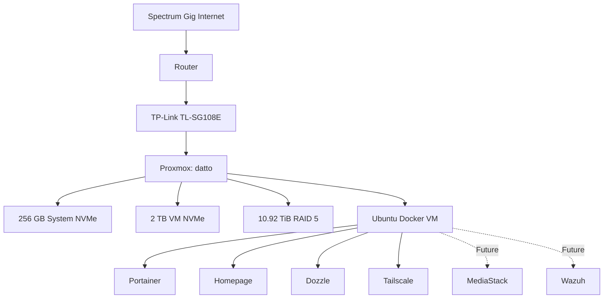

# Architecture Diagram

```mermaid
flowchart TD
    ISP[Spectrum Gig Internet] --> Router
    Router --> Switch[TP-Link TL-SG108E]
    Switch --> Datto[Proxmox: datto]
    Datto --> System[256 GB System NVMe]
    Datto --> VMData[2 TB VM NVMe]
    Datto --> RAID[10.92 TiB RAID 5]
    Datto --> Ubuntu[Ubuntu Docker VM]
    Ubuntu --> Portainer
    Ubuntu --> Homepage
    Ubuntu --> Dozzle
    Ubuntu --> Tailscale
    Ubuntu -. Future .-> MediaStack
    Ubuntu -. Future .-> Wazuh
```
